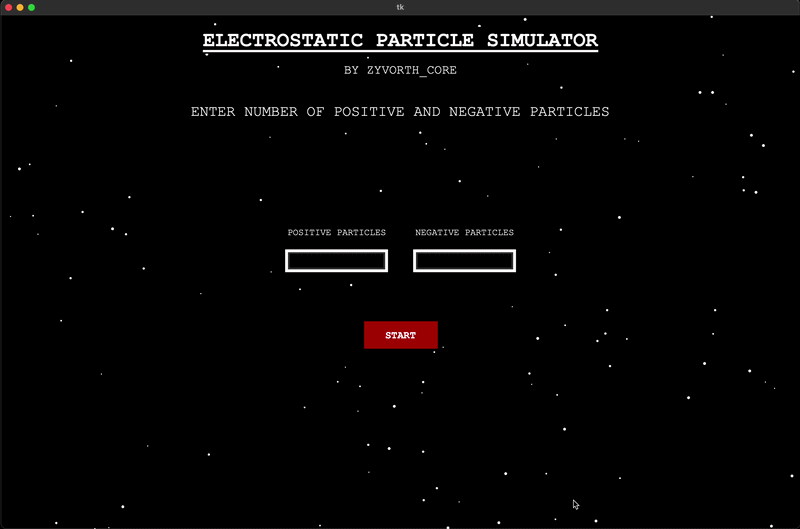
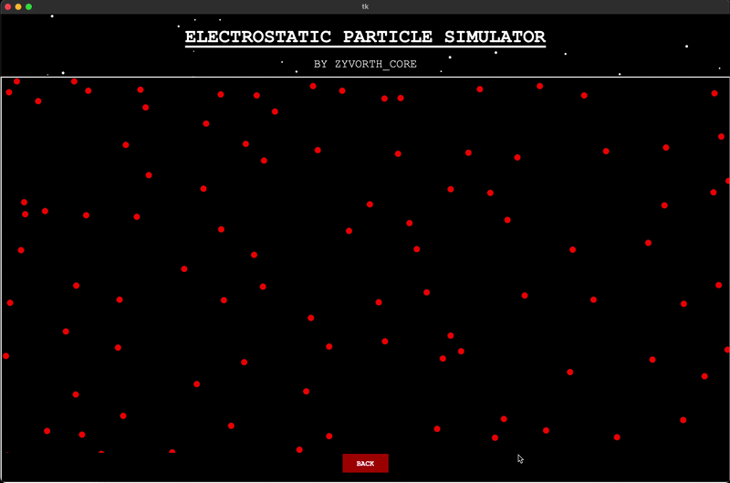

#ELECTROSTATIC PARTICLE SIMULATOR
-----------------------------------

## NOTE FROM ME:

-This simulation is the first simulation that i did with a thought of attaching to git as my first project, this is one of many simulations of the physical world that always facinates me , i feel like i am giving life to these things  using mathematics which impose ceratin rules which these system follows to show us such fascinating behaviour .

-Neverless to say the physics and mathmatical part of this simulation is completely written by me with the knowledge of what i have learned but the GUI aspect of this simulation is vibecoded because i am really impatient to see how my core written in maths and physics work, I am not currently proficient enough in tkinter to achieve the freedom as a creator to impliment what ever my vision is . I am trying my very best to learn the GUI part currently

-This simulation only considers the COULOMBIC FORCE and the changes it causes i have not considered any other physical factors such as gravitational force , magnetic aspects and many more

## Features:

- Random postion intialization
- Positive and negative charge interaction
- Dynamic particle movement
- Real-time force calculations
- Boundary collision handling
- Vector-based motion updates

## Concepts Used

- Trigonometry
- Vector mathematics
- Numerical integration

## Preview

----------------------------------------------------------------------------
- This is the window that will first open up where you have the option to add as many positive/negative charged particle

  

- This is how the simulation will look once executed

  

## How To Run

'''bash 
python ESTAT_DUALCHARGE_SIM.py

